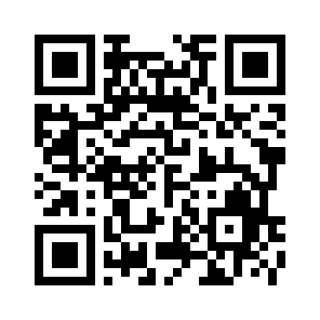
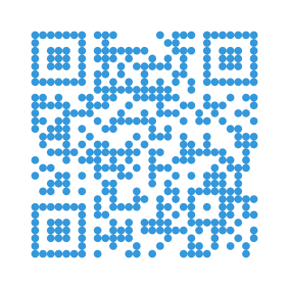
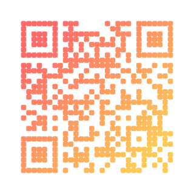
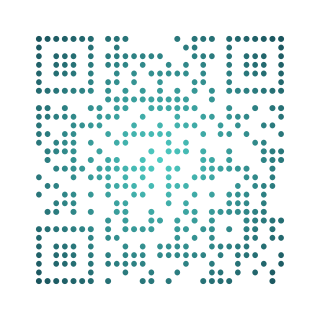
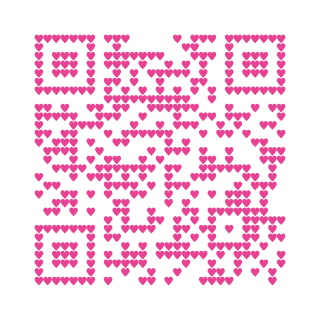
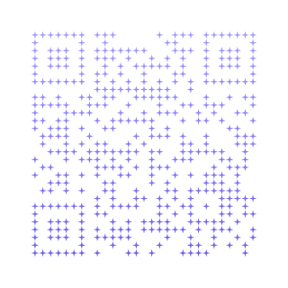
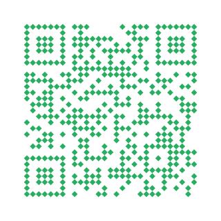
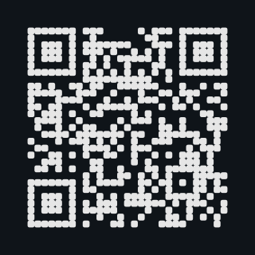
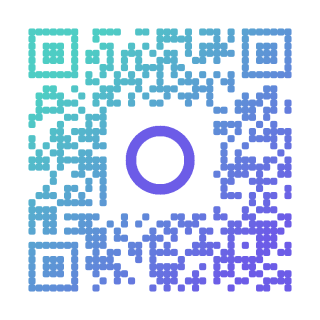

# qr-gode

[](https://pkg.go.dev/github.com/ahmedtahas/qr-gode)
[](https://goreportcard.com/report/github.com/ahmedtahas/qr-gode)
[](https://github.com/ahmedtahas/qr-gode/actions/workflows/go.yml)
[](https://opensource.org/licenses/MIT)


A feature-rich QR code generator library for Go with extensive customization options.

## Showcase

|     |     |     |     |
| :-: | :-: | :-: | :-: |
|  |  |  |  |
| Classic | Circle | Rounded · linear gradient | Dot · radial gradient |
|  |  |  |  |
| Heart | Star · gradient | Diamond | Dark mode |
|  |  |  |  |
| Logo · classic | Logo · rounded gradient |  |  |

> Reproduce these with `go run ./cmd/gen-showcase`.

## Features

- Multiple module shapes (square, circle, rounded, diamond, dot, star, heart)
- Solid colors and gradients (linear & radial)
- Custom images for finder patterns, alignment patterns, and modules
- Logo support with automatic sizing and aspect ratio preservation (from file or in-memory image)
- SVG and PNG output — every styling feature works in both formats
- Configurable error correction levels

## Installation

```bash
go get github.com/ahmedtahas/qr-gode
```

## Quick Start

### CLI Usage

```bash
# Basic QR code
qr-gode "https://example.com"

# Custom styling
qr-gode -shape circle -fg "#3498db" "Hello World"

# Gradient colors
qr-gode -gradient "#ff6b6b,#4ecdc4" -shape rounded "Gradient QR"

# With a logo
qr-gode -logo logo.png "https://example.com"

# Custom images for patterns
qr-gode -finder-img finder.png -module-img dot.png "Custom QR"
```

### CLI Options

| Flag | Description | Default |
|------|-------------|---------|
| `-o` | Output file path (.svg or .png) | `qrcode.svg` |
| `-size` | Output size in pixels | `512` |
| `-shape` | Module shape | `square` |
| `-fg` | Foreground color (hex) | `#000000` |
| `-bg` | Background color (hex) | `#FFFFFF` |
| `-gradient` | Gradient colors (comma-separated) | - |
| `-gradient-angle` | Gradient angle in degrees | `45` |
| `-radial` | Use radial gradient | `false` |
| `-ecl` | Error correction level (L, M, Q, H) | `M` |
| `-logo` | Logo image path (PNG/JPG/SVG) | - |
| `-logo-width` | Logo width in pixels (0 = auto) | `0` |
| `-logo-height` | Logo height in pixels (0 = auto) | `0` |
| `-finder-img` | Custom finder pattern image | - |
| `-align-img` | Custom alignment pattern image | - |
| `-module-img` | Custom module image | - |

## Library Usage

### Builder API (Recommended)

The fluent builder API is the simplest way to generate QR codes:

```go
package main

import (
    "os"

    qrgode "github.com/ahmedtahas/qr-gode"
)

func main() {
    // Simple QR code
    svg, err := qrgode.New("https://example.com").SVG()
    if err != nil {
        panic(err)
    }
    os.WriteFile("qr.svg", svg, 0644)
}
```

#### Styling Options

```go
// Custom colors and shape
svg, _ := qrgode.New("Hello World").
    Size(512).
    Shape(qrgode.ShapeCircle).
    Foreground("#3498db").
    Background("#ffffff").
    SVG()

// Linear gradient
svg, _ := qrgode.New("Gradient QR").
    Shape(qrgode.ShapeRounded).
    LinearGradient(45, "#ff6b6b", "#4ecdc4").
    SVG()

// Radial gradient
svg, _ := qrgode.New("Radial QR").
    Shape(qrgode.ShapeDot).
    RadialGradient(0.5, 0.5, "#ff6b6b", "#4ecdc4", "#45b7d1").
    SVG()
```

#### Adding a Logo

```go
// Auto-sized logo from file (15-30% of QR size, preserves aspect ratio)
svg, _ := qrgode.New("https://example.com").
    Logo("logo.png").
    SVG()

// Logo from in-memory image
svg, _ := qrgode.New("https://example.com").
    LogoImage(myImage). // image.Image
    SVG()

// Custom logo dimensions
svg, _ := qrgode.New("https://example.com").
    Logo("logo.png").
    LogoWidth(100).
    SVG()

// Transparent logo background
svg, _ := qrgode.New("https://example.com").
    Logo("logo.png").
    LogoBackground("transparent").
    SVG()
```

#### Custom Pattern Images

```go
// Use custom images for QR elements
svg, _ := qrgode.New("Custom QR").
    FinderImage("finder.png").
    AlignmentImage("alignment.png").
    ModuleImage("module.png").
    SVG()
```

#### Error Correction

```go
// Higher error correction for logos or damaged codes
svg, _ := qrgode.New("https://example.com").
    ErrorCorrection(qrgode.LevelH). // 30% recovery
    Logo("logo.png").
    SVG()
```

### Functional Options API

Alternative API using functional options:

```go
svg, err := qrgode.GenerateWithOptions("https://example.com",
    qrgode.WithSize(512),
    qrgode.WithModuleShape("circle"),
    qrgode.WithLogo("logo.png"),
)
```

### Direct Config API

For full control, use the Config struct directly:

```go
cfg := qrgode.DefaultConfig()
cfg.Size = 512
cfg.Modules.Shape = "circle"
cfg.Modules.Color = qrgode.NewLinearGradientColor(45, []string{"#ff6b6b", "#4ecdc4"})
cfg.Logo = &qrgode.LogoConfig{
    Path: "logo.png",
}

svg, err := qrgode.Generate("https://example.com", cfg)
```

### Simple Generate Functions

For quick generation without configuration:

```go
// Generate to bytes
svg, err := qrgode.Generate("https://example.com", nil)

// Generate directly to file
err := qrgode.GenerateToFile("https://example.com", nil, "qr.svg")
```

## Available Shapes

Use the typed `Shape` constants for type safety:

| Constant | Value | Description |
|----------|-------|-------------|
| `ShapeSquare` | `"square"` | Standard square modules (default) |
| `ShapeCircle` | `"circle"` | Circular modules |
| `ShapeRounded` | `"rounded"` | Rounded square modules |
| `ShapeDiamond` | `"diamond"` | Diamond/rotated square modules |
| `ShapeDot` | `"dot"` | Small centered dots |
| `ShapeStar` | `"star"` | Star-shaped modules |
| `ShapeHeart` | `"heart"` | Heart-shaped modules |

## Error Correction Levels

| Constant | Recovery Capacity | Use Case |
|----------|-------------------|----------|
| `LevelL` | ~7% | Maximum data density |
| `LevelM` | ~15% | Default, balanced |
| `LevelQ` | ~25% | Better recovery |
| `LevelH` | ~30% | Best recovery, use with logos |

When adding a logo, consider using `LevelQ` or `LevelH` to ensure the QR code remains scannable.

### Scannability check

For logo+ECL combinations that are likely to break scanning, call
`ScannabilityWarnings()` and surface the results however you like:

```go
qr := qrgode.New("https://example.com").
    Logo("logo.png").
    ErrorCorrection(qrgode.LevelM)

for _, msg := range qr.ScannabilityWarnings() {
    log.Println("qrgode:", msg)
}
```

The check is heuristic — print quality, contrast, and scanner camera also
affect real-world scannability — but it catches the common mistake of pairing
a large logo with a low error-correction level.

## Custom Images

### Finder Pattern Image

The finder pattern image should be a 7x7 module pattern:
- Outer ring (dark)
- White gap
- Inner 3x3 square (dark)

### Alignment Pattern Image

The alignment pattern image should be a 5x5 module pattern:
- Outer ring (dark)
- White gap
- Center dot (dark)

### Module Image

Any square image that represents a single dark module.

## Logo Handling

- **Auto-sizing**: By default, logos are scaled to fit within 15-30% of the QR code size
- **Aspect ratio**: Always preserved - logos are never stretched
- **In-memory support**: Use `LogoImage()` to pass an `image.Image` directly
- **SVG logos**: Treated as 1:1 aspect ratio, scale perfectly at any size
- **Background**: White rounded rectangle by default, can be set to transparent
- **Exclusion zone**: Modules under the logo area are not rendered (cleaner than overlay)

## Examples

### Generate to File

```go
// SVG or PNG — chosen from the file extension
err := qrgode.New("https://example.com").
    Shape(qrgode.ShapeCircle).
    LinearGradient(45, "#667eea", "#764ba2").
    Logo("logo.png").
    SaveAs("output.png")
```

### Generate to Bytes

```go
svg, err := qrgode.New("https://example.com").SVG()
png, err := qrgode.New("https://example.com").PNG()
```

### Stream to an io.Writer

```go
// HTTP handler — no intermediate []byte allocation
func handler(w http.ResponseWriter, r *http.Request) {
    w.Header().Set("Content-Type", "image/svg+xml")
    qrgode.New(r.URL.Query().Get("data")).WriteTo(w)
}
```

### Validate Custom Images

```go
// Validate before using
if err := qrgode.ValidateFinderImage("finder.png"); err != nil {
    log.Fatal(err)
}

if err := qrgode.ValidateLogoImage("logo.png"); err != nil {
    log.Fatal(err)
}
```

## License

MIT License
